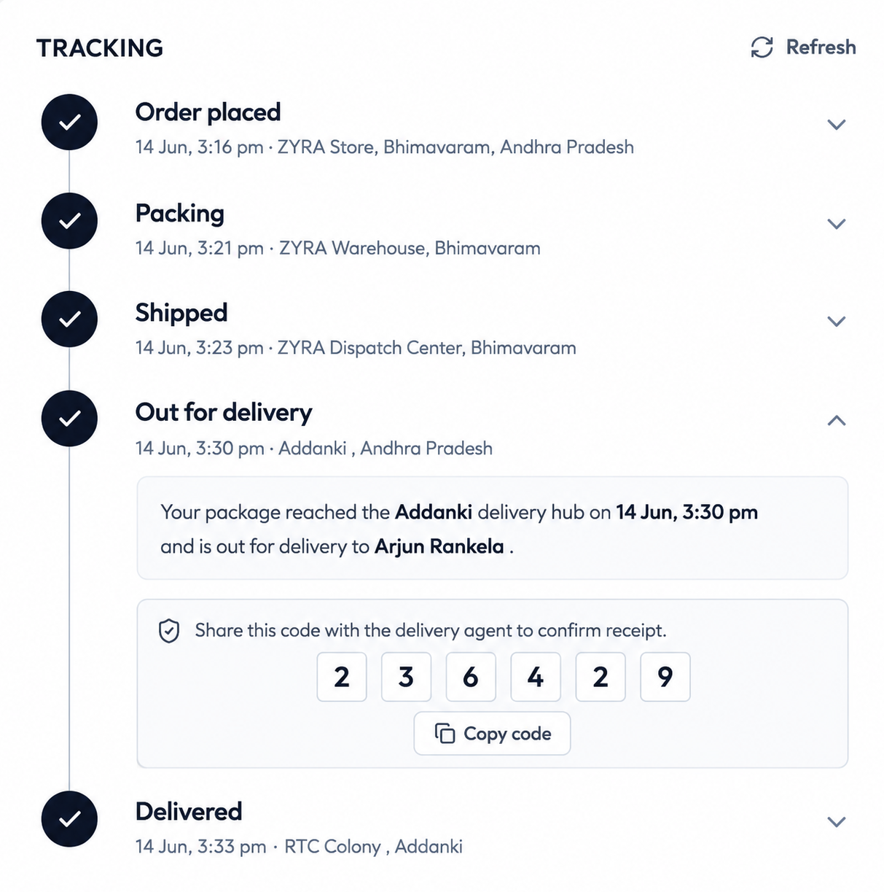

# ZYRA — Full Stack Fashion Commerce Platform

<p align="center">
  
  
  
  
  
  
  
</p>

<p align="center">
  A production-ready MERN stack e-commerce platform with secure authentication, multi-gateway payments, real-time order tracking, and a dedicated admin dashboard.
</p>

<p align="center">
  <a href="https://zyrafashion.vercel.app/">
    
  </a>
</p>

---

## Overview

ZYRA is a complete fashion e-commerce solution built on the MERN stack. It delivers a polished shopping experience on the customer side while giving administrators full control over products and orders through a dedicated panel.

The platform handles everything from product discovery and cart management to payment processing, order fulfillment, and delivery verification — all in a responsive, performant interface.

---

## 🔗 Quick Links

<p align="center">
  
<a href="https://zyrafashion.vercel.app/">
    
  </a>
  
<a href="https://admin-zyra.vercel.app/">
  
</a>

<a href="https://zyra-backend-tan.vercel.app/">
  
</a>

<a href="https://github.com/venkata-arjun/zyra-platform">
  
</a>

</p>

---

## Features

### Customer

- Responsive landing page with latest collections and best sellers
- Product search with category and sub-category filters
- Detailed product pages with related product suggestions
- Shopping cart with quantity management
- Checkout with multiple payment methods
- Order history with real-time status tracking
- Delivery verification code system
- Profile management and password update

### Admin

- Product management — add, edit, delete, and list products
- Multi-image upload via Cloudinary
- Order management with search and filter
- View full customer and shipping details
- Update order status through the delivery pipeline

### Payments

Stripe, Razorpay, and Cash on Delivery (COD) are all supported at checkout.

---

## Tech Stack

### Frontend

- React 19, Vite
- Tailwind CSS
- React Router DOM
- Axios
- React Hot Toast
- Lucide React

### Backend

- Node.js, Express.js
- MongoDB, Mongoose
- JWT Authentication
- Multer, Cloudinary

### Payments

- Stripe
- Razorpay

### Deployment

- Vercel (frontend, admin, backend)
- MongoDB Atlas
- Cloudinary

---

## Architecture

```
React Frontend (Customer + Admin)
            |
        Axios REST API
            |
   Express + Node.js Server
            |
   ┌────────┼────────────┐
   |        |            |
MongoDB  Cloudinary  Payment Gateway
                    (Stripe / Razorpay)
```

---

## Order Tracking Pipeline

<p align="center">
  
  <br>
  <sub><b>Real-time order lifecycle from placement to successful delivery.</b></sub>
</p>

Each stage includes live status updates, payment status, delivery verification code, shipping address, and a full order summary.

---

## Folder Structure

```
zyra-platform/
├── frontend/
│   └── src/
│       ├── assets/
│       ├── components/
│       ├── context/
│       ├── data/
│       ├── pages/
│       ├── utils/
│       └── App.jsx
├── backend/
│   ├── config/
│   ├── controllers/
│   ├── middleware/
│   ├── models/
│   ├── routes/
│   └── server.js
├── admin/
│   └── src/
│       ├── components/
│       ├── pages/
│       └── App.jsx
└── README.md
```

---

## Installation

### Clone the repository

```bash
git clone https://github.com/venkata-arjun/zyra-platform.git
cd zyra-platform
```

### Frontend

```bash
cd frontend
npm install
npm run dev
```

### Backend

```bash
cd backend
npm install
npm run dev
```

### Admin

```bash
cd admin
npm install
npm run dev
```

---

## Environment Variables

### Frontend — `.env`

```env
VITE_BACKEND_URL=
VITE_RAZORPAY_KEY_ID=
```

### Backend — `.env`

```env
MONGODB_URI=

JWT_SECRET=

CLOUDINARY_NAME=
CLOUDINARY_API_KEY=
CLOUDINARY_SECRET=

STRIPE_SECRET_KEY=

RAZORPAY_KEY_ID=
RAZORPAY_KEY_SECRET=

ADMIN_EMAIL=
ADMIN_PASSWORD=
```

---

## Application Flow

```
Home  →  Collections  →  Product Details  →  Cart  →  Checkout  →  Payment  →  Order Confirmation  →  Tracking  →  Delivery
```

### Admin Flow

```
Login  →  Dashboard  →  Products (Add / Edit / Delete)  →  Orders  →  Update Status  →  Customer Delivery
```

---

## Core Functionalities

- JWT-based authentication
- MongoDB data persistence
- Full product CRUD with image upload
- Shopping cart and checkout flow
- Stripe and Razorpay payment integration
- Cash on delivery support
- Order placement and real-time tracking
- Delivery verification code
- Profile and password management
- Admin product and order management

---

## Planned Improvements

- Wishlist functionality
- Product reviews and ratings
- Coupon and discount system
- Email notifications
- Inventory analytics and sales dashboard
- Admin charts
- AI product recommendations
- Dark mode
- Progressive Web App (PWA) support

---

## Contributing

Contributions are welcome.

1. Fork the repository
2. Create a feature branch

```bash
git checkout -b feature/your-feature-name
```

3. Commit your changes

```bash
git commit -m "Add your feature description"
```

4. Push the branch

```bash
git push origin feature/your-feature-name
```

5. Open a Pull Request

---

<p align="center"> <b>Rankela Venkata Arjun</b> &nbsp;|&nbsp; Full Stack MERN Developer </p>

<p align="center">


</p>


<p align="center">Built with the MERN Stack and deployed on Vercel.</p>
